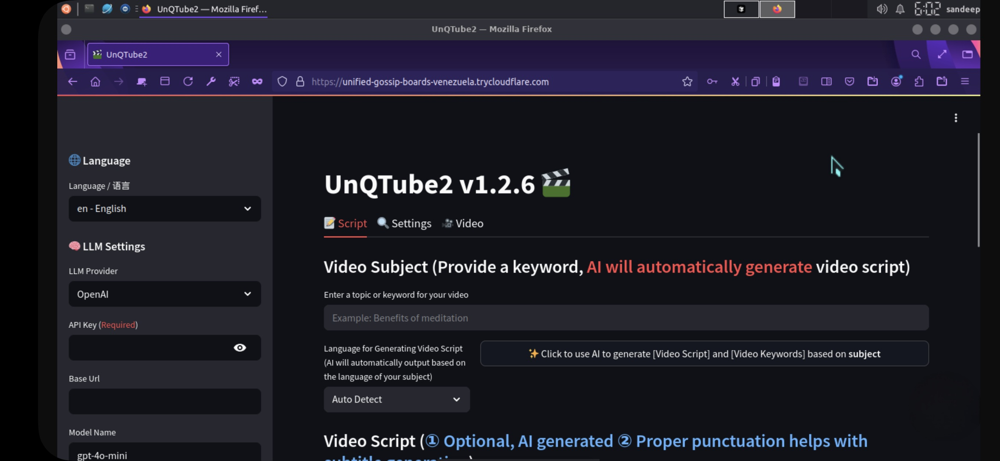

<div align="center">
<h1 align="center">UnQTube2 💸</h1>

<p align="center">
  <a href="https://github.com/Sandeepgaddam5432/UnQTube2/stargazers"></a>
  <a href="https://github.com/Sandeepgaddam5432/UnQTube2/issues"></a>
  <a href="https://github.com/Sandeepgaddam5432/UnQTube2/network/members"></a>
  <a href="https://github.com/Sandeepgaddam5432/UnQTube2/blob/main/LICENSE"></a>
</p>
<br>

Simply provide a video <b>topic</b> or <b>keyword</b>, and it will automatically generate the video script, video materials, video subtitles, and background music, then synthesize a high-definition short video.
<br>

<h4>Web Interface</h4>



<h4>API Interface</h4>


</div>

## Features 🎯

- [x] Complete **MVC architecture**, **clearly structured** code, easy to maintain, supports both `API` and `Web interface`
- [x] Supports **AI-generated** video scripts, as well as **customized scripts**
- [x] Supports various **high-definition video** sizes
    - [x] Portrait 9:16, `1080x1920`
    - [x] Landscape 16:9, `1920x1080`
- [x] Supports **batch video generation**, allowing the creation of multiple videos at once, then selecting the most satisfactory one
- [x] Supports setting the **duration of video clips**, facilitating adjustments to material switching frequency
- [x] Supports video scripts in both **Chinese** and **English**
- [x] Supports **multiple voice** synthesis, with **real-time preview** of effects
- [x] Supports **subtitle generation**, with adjustable `font`, `position`, `color`, `size`, and also supports `subtitle outlining`
- [x] Supports **background music**, either random or specified music files, with adjustable `background music volume`
- [x] Video material sources are **high-definition** and **royalty-free**, and you can also use your own **local materials**
- [x] Supports integration with various models such as **OpenAI**, **Moonshot**, **Azure**, **gpt4free**, **one-api**, **Qwen**, **Google Gemini**, **Ollama**, **DeepSeek**, **ERNIE**, **Pollinations** etc.
    - For users in China, it's recommended to use **DeepSeek** or **Moonshot** as LLM providers (accessible within China without VPN. Registration provides free credits that are generally sufficient)

### Future Plans 📅

- [ ] GPT-SoVITS dubbing support
- [ ] Optimize voice synthesis using large models for more natural and emotionally rich voice output
- [ ] Add video transition effects for a smoother viewing experience
- [ ] Add more video material sources, improve the matching between video materials and scripts
- [ ] Add video length options: short, medium, long
- [ ] Support more voice synthesis providers, such as OpenAI TTS
- [ ] Automate upload to YouTube platform

## Video Demos 📺

### Portrait 9:16

<table>
<thead>
<tr>
<th align="center"><g-emoji class="g-emoji" alias="arrow_forward">▶️</g-emoji> "How to Add Fun to Your Life"</th>
<th align="center"><g-emoji class="g-emoji" alias="arrow_forward">▶️</g-emoji> "The Role of Money"<br>More realistic synthetic voice</th>
<th align="center"><g-emoji class="g-emoji" alias="arrow_forward">▶️</g-emoji> "What is the Meaning of Life"</th>
</tr>
</thead>
<tbody>
<tr>
<td align="center"><video src="https://github.com/Sandeepgaddam5432/UnQTube2/assets/4928832/a84d33d5-27a2-4aba-8fd0-9fb2bd91c6a6"></video></td>
<td align="center"><video src="https://github.com/Sandeepgaddam5432/UnQTube2/assets/4928832/af2f3b0b-002e-49fe-b161-18ba91c055e8"></video></td>
<td align="center"><video src="https://github.com/Sandeepgaddam5432/UnQTube2/assets/4928832/112c9564-d52b-4472-99ad-970b75f66476"></video></td>
</tr>
</tbody>
</table>

### Landscape 16:9

<table>
<thead>
<tr>
<th align="center"><g-emoji class="g-emoji" alias="arrow_forward">▶️</g-emoji>"What is the Meaning of Life"</th>
<th align="center"><g-emoji class="g-emoji" alias="arrow_forward">▶️</g-emoji>"Why Exercise"</th>
</tr>
</thead>
<tbody>
<tr>
<td align="center"><video src="https://github.com/Sandeepgaddam5432/UnQTube2/assets/4928832/346ebb15-c55f-47a9-a653-114f08bb8073"></video></td>
<td align="center"><video src="https://github.com/Sandeepgaddam5432/UnQTube2/assets/4928832/271f2fae-8283-44a0-8aa0-0ed8f9a6fa87"></video></td>
</tr>
</tbody>
</table>

## System Requirements 📦

- Recommended minimum CPU **4 cores** or more, memory **4G** or more, GPU is not required
- Windows 10 or MacOS 11.0 or higher


## Quick Start 🚀

### Run in Google Colab
Skip local environment setup, click to quickly experience UnQTube2 in Google Colab

[](https://colab.research.google.com/github/Sandeepgaddam5432/UnQTube2/blob/main/docs/UnQTube2.ipynb)


### Windows One-Click Launcher

Download the one-click launcher package, extract and use directly (path should not contain **Chinese characters**, **special characters**, or **spaces**)

- Google Drive (v1.2.6): https://drive.google.com/file/d/1HsbzfT7XunkrCrHw5ncUjFX8XX4zAuUh/view?usp=sharing

After downloading, it is recommended to **double-click** `update.bat` first to update to the **latest code**, then double-click `start.bat` to launch

After launching, the browser will open automatically (if it opens blank, it is recommended to use **Chrome** or **Edge**)

## Installation & Deployment 📥

### Prerequisites

- Try to avoid using **Chinese paths** to prevent unexpected issues
- Please ensure your **internet connection** is working properly, VPN needs to be set to `global traffic` mode

#### ① Clone the Code

```shell
git clone https://github.com/Sandeepgaddam5432/UnQTube2.git
```

#### ② Modify Configuration File (Optional, you can also configure in the WebUI after launch)

- Copy the `config.example.toml` file and rename it to `config.toml`
- Follow the instructions in the `config.toml` file to configure `pexels_api_keys` and `llm_provider`, and set up the corresponding API Key based on your chosen LLM provider

### Docker Deployment 🐳

#### ① Start Docker

If you haven't installed Docker, please install it first from https://www.docker.com/products/docker-desktop/

If you are using Windows, please refer to Microsoft's documentation:

1. https://learn.microsoft.com/en-us/windows/wsl/install
2. https://learn.microsoft.com/en-us/windows/wsl/tutorials/wsl-containers

```shell
cd UnQTube2
docker-compose up
```

> Note: The latest version of Docker installs Docker Compose automatically as a plugin, so the start command should be `docker compose up`

#### ② Access Web Interface

Open your browser and visit http://0.0.0.0:8501

#### ③ Access API Documentation

Open your browser and visit http://0.0.0.0:8080/docs or http://0.0.0.0:8080/redoc

### Manual Deployment 📦

> Video Tutorials

- Complete usage demonstration: https://v.douyin.com/iFhnwsKY/
- How to deploy on Windows: https://v.douyin.com/iFyjoW3M

#### ① Create Virtual Environment

It is recommended to use [conda](https://conda.io/projects/conda/en/latest/user-guide/install/index.html) to create a Python virtual environment

```shell
git clone https://github.com/Sandeepgaddam5432/UnQTube2.git
cd UnQTube2
conda create -n UnQTube2 python=3.11
conda activate UnQTube2
pip install -r requirements.txt
```

#### ② Install ImageMagick

- Windows:
    - Download from https://imagemagick.org/script/download.php - select Windows version, make sure to choose the **static library** version, such as ImageMagick-7.1.1-32-Q16-x64-**static**.exe
    - Install the downloaded ImageMagick, **do not change the installation path**
    - Modify the `imagemagick_path` in `config.toml` to your **actual installation path**

- MacOS:
  ```shell
  brew install imagemagick
  ````
- Ubuntu
  ```shell
  sudo apt-get install imagemagick
  ```
- CentOS
  ```shell
  sudo yum install ImageMagick
  ```

#### ③ Start Web Interface 🌐

Note that you need to execute the following commands in the `root directory` of the UnQTube2 project

###### Windows

```bat
webui.bat
```

###### MacOS or Linux

```shell
sh webui.sh
```

After launching, the browser will open automatically (if it opens blank, it is recommended to use **Chrome** or **Edge**)

#### ④ Start API Service 🚀

```shell
python main.py
```

After starting, you can view the `API Documentation` at http://127.0.0.1:8080/docs or http://127.0.0.1:8080/redoc for direct online testing.

## Voice Synthesis 🗣

For a complete list of all supported voices, see: [Voice List](./docs/voice-list.txt)

As of 2024-04-16 (v1.1.2), 9 new Azure voice synthesis options were added, which require API KEY configuration. These voices sound more realistic.

## Subtitle Generation 📜

Currently, two subtitle generation methods are supported:

- **edge**: Faster generation, better performance, no specific computer requirements, but quality may be inconsistent
- **whisper**: Slower generation, worse performance, some computer requirements, but more reliable quality.

You can switch between them by modifying the `subtitle_provider` in the `config.toml` configuration file

It's recommended to use the `edge` mode first, and if subtitle quality is unsatisfactory, switch to `whisper` mode

> Note:

1. Whisper mode requires downloading a model file from HuggingFace (approximately 3GB), please ensure your network connection is stable
2. If left blank, subtitles will not be generated.

> For users in China who cannot access HuggingFace, you can download the `whisper-large-v3` model file using the following methods

Download links:

- Google Drive: https://drive.google.com/drive/folders/1QX3B1YMe4H3g0lJCrN9fymO-lY_BDjXJ?usp=sharing

After downloading the model, extract it and place the entire directory in `.\UnQTube2\models`,
The final file path should look like this: `.\UnQTube2\models\whisper-large-v3`

```
UnQTube2  
  ├─models
  │   └─whisper-large-v3
  │          config.json
  │          model.bin
  │          preprocessor_config.json
  │          tokenizer.json
  │          vocabulary.json
```

## Background Music 🎵

Background music for videos is located in the `resource/songs` directory of the project.
> The project includes some default music from YouTube videos. Please remove if there are any copyright concerns.

## Subtitle Fonts 🅰

Fonts used for video subtitles are located in the `resource/fonts` directory of the project. You can add your own fonts here.

## Common Issues 🤔

### ❓RuntimeError: No ffmpeg exe could be found

Under normal circumstances, ffmpeg is downloaded automatically and detected automatically.
However, if there is an issue with your environment that prevents automatic downloading, you might encounter the following error:

```
RuntimeError: No ffmpeg exe could be found.
Install ffmpeg on your system, or set the IMAGEIO_FFMPEG_EXE environment variable.
```

In such cases, you can download ffmpeg from https://www.gyan.dev/ffmpeg/builds/, extract it, and set `ffmpeg_path` to your actual installation path.

```toml
[app]
# Please set according to your actual path, note that Windows path separator is \\
ffmpeg_path = "C:\\Users\\user\\Downloads\\ffmpeg.exe"
```

### ❓ImageMagick's security policy blocks operations related to temporary file @/tmp/tmpur5hyyto.txt

You can find these policies in ImageMagick's configuration file policy.xml.
This file is typically located at /etc/ImageMagick-`X`/ or a similar location in the ImageMagick installation directory.
Modify the entry containing `pattern="@"` by changing `rights="none"` to `rights="read|write"` to allow read and write operations on files.

### ❓OSError: [Errno 24] Too many open files

This issue is caused by system limitations on the number of open files. You can solve it by modifying the system's file open limit.

Check current limit:

```shell
ulimit -n
```

If it's too low, increase it:

```shell
ulimit -n 10240
```

### ❓Whisper model download failure, with errors like:

LocalEntryNotFoundError: Cannot find an appropriate cached snapshot folder for the specified revision on the local disk and
outgoing traffic has been disabled. To enable repo look-ups and downloads online, pass 'local files only=False' as input.

Or:

An error occurred while synchronizing the model Systran/faster-whisper-large-v3 from the Hugging Face Hub:
An error happened while trying to locate the files on the Hub and we cannot find the appropriate snapshot folder for the
specified revision on the local disk. Please check your internet connection and try again.
Trying to load the model directly from the local cache, if it exists.

Solution: [Click to see how to manually download the model from Google Drive](#subtitle-generation-)

## Feedback & Suggestions 📢

- You can submit an [issue](https://github.com/Sandeepgaddam5432/UnQTube2/issues) or
  a [pull request](https://github.com/Sandeepgaddam5432/UnQTube2/pulls).

## License 📝

See the [`LICENSE`](LICENSE) file

## Star History

[](https://star-history.com/#Sandeepgaddam5432/UnQTube2&Date)